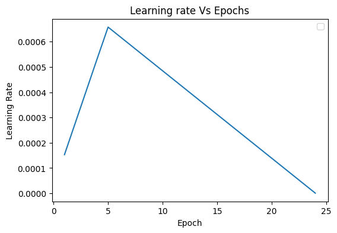

# S10 - Custom ResNet - CIFAR10 DataSet
This is the repository which contains the assignment work of Session 10

## Description

This project includes 7 Python files: `abstract_dataset.py`, `utils.py`, 'back_propogation.py', 'cifar10_dataset.py', 'model.py', 'model_training.py', 'scheduler.py' and one notebook `S10.ipynb'. All the python (.py) files are placed in the **cifar** folder. These files are part of a machine learning project for image classification using the CIFAR10 dataset. The project is about training a custom ResNet neural network model to recognize images using 6.5 million parameters, and obtain test accuracy equal to or greater than 90%. The weights corresponding to the best accuracies (>=90%) are placed in the folder **weights** 

Few samples in the dataset are shown below.


## Files

### 1. model.py

This file 'model.py' defines a custom ResNet neural network architecture using PyTorch. This custom implementation includes the convLayer, custBlock, and custResNet classes, each responsible for different parts of the model. The ResNet architecture is a popular deep learning model known for its skip connections, which enable the training of very deep networks. 

**convLayer** - The convLayer class represents a convolutional layer with optional max pooling, batch normalization, ReLU activation, and dropout. It takes parameters such as input and output channels, kernel size, stride, padding, and dropout probability. The class defines a forward method that applies the convolution, pooling (if enabled), normalization, activation, and dropout (if specified) operations on the input.

**custBlock** - The custBlock class represents a custom block within the ResNet architecture. It consists of a convolutional and pooling block, followed by residual connections. The number of residual connections can be specified using the residual_links parameter. The class defines a forward method that applies the convolutional and pooling block operations and adds the residual connections if specified.

**custResNet** - The custResNet class represents the main custom ResNet model. It consists of a preparation block, followed by multiple custBlock blocks, and ends with a max pooling layer, flattening layer, and fully connected layer. The number of output classes can be adjusted by changing the size of the fully connected layer. The class defines a forward method that applies the different blocks and layers to generate the final output. It also provides a summary method to get a summary of the network architecture.

- Network Architecture -
  - Prep Layer - (Conv 3x3 s1, p1) >> BN >> RELU [64k]
  - Block1 (with residual links added)
    - X = Conv 3x3 (s1, p1) >> MaxPool2D >> BN >> RELU [128k]
    - R1 (Residual Layer) = ResBlock( (Conv-BN-ReLU-Conv-BN-ReLU))(X) [128k]
    - Add(X, R1)
  - Block2 (non residual layer)
    - Conv 3x3 [256k]
    - MaxPooling2D
    - BN
    - ReLU
  - Block3(with residual links added)
    - X = Conv 3x3 (s1, p1) >> MaxPool2D >> BN >> RELU [512k]
    - R2 (Residual Layer) = ResBlock((Conv-BN-ReLU-Conv-BN-ReLU))(X) [512k]
    - Add(X, R2)
  - Output Layer
    - MaxPooling with Kernel Size 4
    - FC Layer
    - SoftMax

To run this code, we can create an instance of the Net class, pass input data through the network using the forward method, and utilize the summary method to get a summary of the network architecture.

#### 1.1 Custom ResNet Model Architecture Summary gave Parameter Count = 6,573,130 (Refer the S10.ipnb file for the model summary details)

The receptive field at the output block of this model is 81

```
=====================================================================================================================================================================
Layer (type:depth-idx)                   Input Shape               Output Shape              Param #                   Kernel Shape              Param %
=====================================================================================================================================================================
custResNet                               [512, 3, 32, 32]          [512, 10]                 --                        --                             --
├─custBlock: 1-1                         [512, 3, 32, 32]          [512, 64, 32, 32]         --                        --                             --
│    └─convLayer: 2-1                    [512, 3, 32, 32]          [512, 64, 32, 32]         --                        --                             --
│    │    └─Conv2d: 3-1                  [512, 3, 32, 32]          [512, 64, 32, 32]         1,728                     [3, 3]                      0.03%
│    │    └─BatchNorm2d: 3-2             [512, 64, 32, 32]         [512, 64, 32, 32]         128                       --                          0.00%
│    │    └─ReLU: 3-3                    [512, 64, 32, 32]         [512, 64, 32, 32]         --                        --                             --
├─custBlock: 1-2                         [512, 64, 32, 32]         [512, 128, 16, 16]        --                        --                             --
│    └─convLayer: 2-2                    [512, 64, 32, 32]         [512, 128, 16, 16]        --                        --                             --
│    │    └─Conv2d: 3-4                  [512, 64, 32, 32]         [512, 128, 32, 32]        73,728                    [3, 3]                      1.12%
│    │    └─MaxPool2d: 3-5               [512, 128, 32, 32]        [512, 128, 16, 16]        --                        2                              --
│    │    └─BatchNorm2d: 3-6             [512, 128, 16, 16]        [512, 128, 16, 16]        256                       --                          0.00%
│    │    └─ReLU: 3-7                    [512, 128, 16, 16]        [512, 128, 16, 16]        --                        --                             --
│    └─Sequential: 2-3                   [512, 128, 16, 16]        [512, 128, 16, 16]        --                        --                             --
│    │    └─convLayer: 3-8               [512, 128, 16, 16]        [512, 128, 16, 16]        --                        --                             --
│    │    │    └─Conv2d: 4-1             [512, 128, 16, 16]        [512, 128, 16, 16]        147,456                   [3, 3]                      2.24%
│    │    │    └─BatchNorm2d: 4-2        [512, 128, 16, 16]        [512, 128, 16, 16]        256                       --                          0.00%
│    │    │    └─ReLU: 4-3               [512, 128, 16, 16]        [512, 128, 16, 16]        --                        --                             --
│    │    └─convLayer: 3-9               [512, 128, 16, 16]        [512, 128, 16, 16]        --                        --                             --
│    │    │    └─Conv2d: 4-4             [512, 128, 16, 16]        [512, 128, 16, 16]        147,456                   [3, 3]                      2.24%
│    │    │    └─BatchNorm2d: 4-5        [512, 128, 16, 16]        [512, 128, 16, 16]        256                       --                          0.00%
│    │    │    └─ReLU: 4-6               [512, 128, 16, 16]        [512, 128, 16, 16]        --                        --                             --
├─custBlock: 1-3                         [512, 128, 16, 16]        [512, 256, 8, 8]          --                        --                             --
│    └─convLayer: 2-4                    [512, 128, 16, 16]        [512, 256, 8, 8]          --                        --                             --
│    │    └─Conv2d: 3-10                 [512, 128, 16, 16]        [512, 256, 16, 16]        294,912                   [3, 3]                      4.49%
│    │    └─MaxPool2d: 3-11              [512, 256, 16, 16]        [512, 256, 8, 8]          --                        2                              --
│    │    └─BatchNorm2d: 3-12            [512, 256, 8, 8]          [512, 256, 8, 8]          512                       --                          0.01%
│    │    └─ReLU: 3-13                   [512, 256, 8, 8]          [512, 256, 8, 8]          --                        --                             --
├─custBlock: 1-4                         [512, 256, 8, 8]          [512, 512, 4, 4]          --                        --                             --
│    └─convLayer: 2-5                    [512, 256, 8, 8]          [512, 512, 4, 4]          --                        --                             --
│    │    └─Conv2d: 3-14                 [512, 256, 8, 8]          [512, 512, 8, 8]          1,179,648                 [3, 3]                     17.95%
│    │    └─MaxPool2d: 3-15              [512, 512, 8, 8]          [512, 512, 4, 4]          --                        2                              --
│    │    └─BatchNorm2d: 3-16            [512, 512, 4, 4]          [512, 512, 4, 4]          1,024                     --                          0.02%
│    │    └─ReLU: 3-17                   [512, 512, 4, 4]          [512, 512, 4, 4]          --                        --                             --
│    └─Sequential: 2-6                   [512, 512, 4, 4]          [512, 512, 4, 4]          --                        --                             --
│    │    └─convLayer: 3-18              [512, 512, 4, 4]          [512, 512, 4, 4]          --                        --                             --
│    │    │    └─Conv2d: 4-7             [512, 512, 4, 4]          [512, 512, 4, 4]          2,359,296                 [3, 3]                     35.89%
│    │    │    └─BatchNorm2d: 4-8        [512, 512, 4, 4]          [512, 512, 4, 4]          1,024                     --                          0.02%
│    │    │    └─ReLU: 4-9               [512, 512, 4, 4]          [512, 512, 4, 4]          --                        --                             --
│    │    └─convLayer: 3-19              [512, 512, 4, 4]          [512, 512, 4, 4]          --                        --                             --
│    │    │    └─Conv2d: 4-10            [512, 512, 4, 4]          [512, 512, 4, 4]          2,359,296                 [3, 3]                     35.89%
│    │    │    └─BatchNorm2d: 4-11       [512, 512, 4, 4]          [512, 512, 4, 4]          1,024                     --                          0.02%
│    │    │    └─ReLU: 4-12              [512, 512, 4, 4]          [512, 512, 4, 4]          --                        --                             --
├─MaxPool2d: 1-5                         [512, 512, 4, 4]          [512, 512, 1, 1]          --                        4                              --
├─Flatten: 1-6                           [512, 512, 1, 1]          [512, 512]                --                        --                             --
├─Linear: 1-7                            [512, 512]                [512, 10]                 5,130                     --                          0.08%
=====================================================================================================================================================================
Total params: 6,573,130
Trainable params: 6,573,130
Non-trainable params: 0
Total mult-adds (G): 194.18
=====================================================================================================================================================================
Input size (MB): 6.29
Forward/backward pass size (MB): 2382.41
Params size (MB): 26.29
Estimated Total Size (MB): 2414.99
=====================================================================================================================================================================
```

### 2. back_propogation.py
This file also has **train** and **test** functions which perform the training and evaluation functionalities respectively and return the train loss, train accuracy, and test loss, test accuracy respectively. The loss function used is CrossEntropyLoss

### 3. utils.py

The `utils.py` file contains helper functions that are used throughout the project. These functions provide some common functionalities for acquiring underlying device specifics like whether CUDA/GPU is available, visualization, or any other necessary operations. It includes function to obtain the samples of mis-classifications (function: **get_incorrect_test_predictions**) and function to obtain the device underneath (function: **get_device**).

### 4. abstract_dataset.py

The `abstract_dataset.py` file contains the abstract class **dataSet** which defines the needed data set attributes and methods. This is the base class which can be used for various data set types like MNIST, CIFAR and so on. In the context of this project, this base class is inherited to define the CIFAR10 specific data set operations and transforms. The basic functionality to obtain train and test transforms, to obtain train and test data loaders which finally get loaded into the model, and functionality to visualize data set images **show_dataset_images** as needed for this project are defined as methods in this class.

### 5. cifar10_dataset.py

This file contains the definition of cifar10Set which defines the needed attributes and methods for CIFAR10 data set. This class also inherits the needed methods from albumentationTransforms class to perform the desired transformations on the CIFAR10 data set. The transformations or the image augmentations performed after normalizing the train data set are **ColorJitter**, **ToGray**, **PadIfNeeded**, **RandomCrop**, **HorizontalFlip** (also known as FlipLR), **CoarseDropout** (also known as CutOut). The parameter values and the probabilities of performing these augmentations were tuned to give out accuracies >= 90% in 24 epochs. It is observed that ShiftScaleRotate led to more under-fitting of the model. Hence this is not used in the final model.

### 6. model_training.py

This file contains class **trainModel** which covers the attributes and the functionality needed to execute the training of the model. The method of this class that actually trains the model is **run_training_model**. This method uses the train and test methods of backpropogation.py file for training and validating the model. The other methods of this trainModel class are - **display_model_stats** to show the model statistics, **show_epoch_progress** to show the progress of learning rate, train, test accuracies/losses at the end of each epoch, **get_best_lr** which uses LRFinder class that is imported from the torch_lr_finder module. The **get_best_lr** uses the learning rate range test which increases the learning rate in a pre-training run between two boundaries in an exponential manner and returns the best or the maximum or optimal learning rate. The optimizer and loss function used in training the model are Adam and CrossEntropyLoss.   

### 7. scheduler.py

This file contains methods **get_sgd_optimizer** to return the SGD optimizer, **get_one_cycle_LR_scheduler** to return the scheduler based on One cycle Policy with increasing learning rate to give maximum learning rate at the 5th epoch out of 24 epochs of the cycle time, and defining the cycle time to be 2 phased. This file also contains the method **get_adam_optimizer** to return the ADAM optimizer.

### 8. S10.ipynb

The `S10.ipynb` file is the notebook that has executions of training model based on the network architecture custResNet so as to execute the model which gives 90%+ accuracy using 6.5 million parameters in 24 epochs. 

#### 8.1. Descritpion of basic components in the notebook

This `S10.ipynb`file contain code for training and evaluating a neural network model using the CIFAR10 dataset. These files include the following components:

- Importing necessary libraries and dependencies
- Mounting Google Drive
- Setting up the device (CPU or GPU)
- Defining data transformations for training and testing
- Loading the CIFAR10 dataset
- Setting up data loaders
- Displaying sample data from the training set
- Defining the neural network model (model1) and displaying its summary
- Training the model using Adam optimizer and CrossEntropyLoss
- Displaying model training and testing statistics
- Displaying the incorrect test image predictions

In addition to the above components, each of these notebooks contain "Target-Results-Analysis" section for the model executed.

Dropout used is 0 (as no over-fitting observed). No Regularization is used as no over-fitting is observed. One cycle learning rate has the following LRMIN and LRMAX values
  - LRMIN = 0.000001
  - LRMAX = 0.000658

#### 8.2. Findings of training the model

**Results:**

- Parameters: 6,573,130 ~= 6.5M
- Best Train Accuracy: 86.76%
- Best Test Accuracy: 92.04% (24th Epoch)
- Test Accuracy: 90.94% (22nd Epoch) [First occurrence of test accuracy >= 90%]

**Analysis:**
- Model has no over fitting through out the training
- Model shows under-fitting performance
- Scheduling OneCycle LR with pct_start = 5/24 gave better train/test accuracies trend in the 24 epochs

The following is the learning rate finder curve while determining the optimal LR value


The train log per epoch is as follows


The learning rate trend following while training the model is as follows 



#### 8.3. Graphs of the Model Statistics [Best Model plots shown below]

The following model statistics for the normalization techniques tried. These plots pertain to the performance of the final optimal model using architecture Net and the other model specifics are highlighted below


#### 8.4. Collection of Mis-classified Predictions

The following image collection shows the mis-classified predictions for the normalization techniques tried. These images pertain to the predictions made by the final optimal model (in S10.ipynb) using architecture Net and the other model specifics are highlighted below


##### 8.5 Images of RF Calculations and Formulae Used

Excel sheet carrying the RF calculations can be found at "RF_Calculation_Coded_with_Formulae.xlsx" and image of these calculations is as follows,


## Usage

To run the project, open the S10.ipynb in github and click on the "Open in Colab" icon in the ipynb file to open the file in Google Colab and start executing the cells of the notebook. The installation of the required dependencies is taken care by executing the following cell of the notebook. 
```
pip install -r requirements.txt
```
We can execute the `S10.ipynb` notebook to perform the training and testing. Adjust the parameters such as dropout, number of epochs to improve the model performance as desired.

Please note that this README serves as a placeholder. As I make further modifications to the project, I would keep this file updated accordingly. 

For more detailed information on the project's implementation and code, please refer to the individual files mentioned above.
